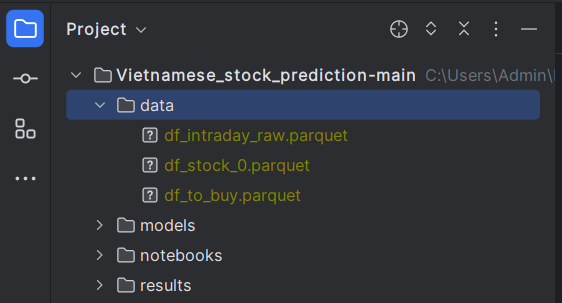

### Vietnamese Stock Prediction
The goal of this project is to predict the close price of specific stocks in interval time.

### How to run
First, install dependencies
```bash
# clone project
git clone https://github.com/mrtrunghieu1/Vietnamese_stock_prediction.git


```

Next, navigate to the stocks of companies
Notice the structure of data folder.



In src/data_helper.py, we will set up some parameters
```bash
# The name of stocks
stock_companies = ['CTG', 'MBB', 'SHB', 'TCB', 'TPB']

# If the name of stock's company doesn't exist 
# parameter này = True là mình sẽ chạy qua toàn bộ dữ liệu trong file df_intraday_raw.parquet
# và nó sẽ tìm ra các stock trong list stock_companies lưu lại dưới file .csv. 
check_alldata_flag = True
# Nếu tôi muốn thử nghiệm mô hình với các models khác mà không muốn chạy lại toàn bộ dữ liệu:
check_alldata_flag = False
```

Run the main module
```bash
# module project
cd src

# run main module 
python main.py
```

